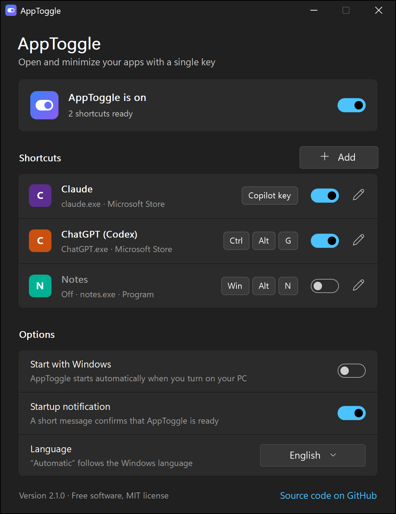
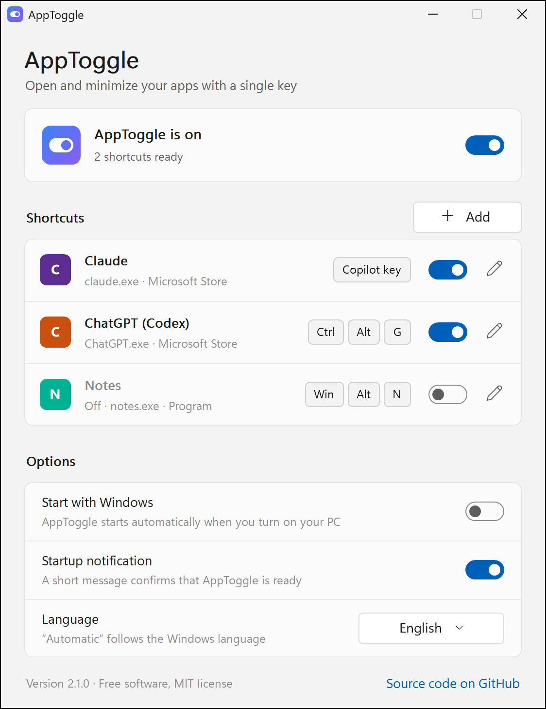
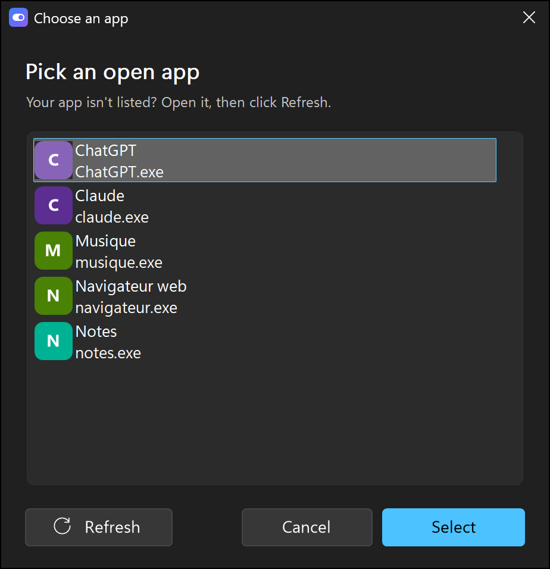
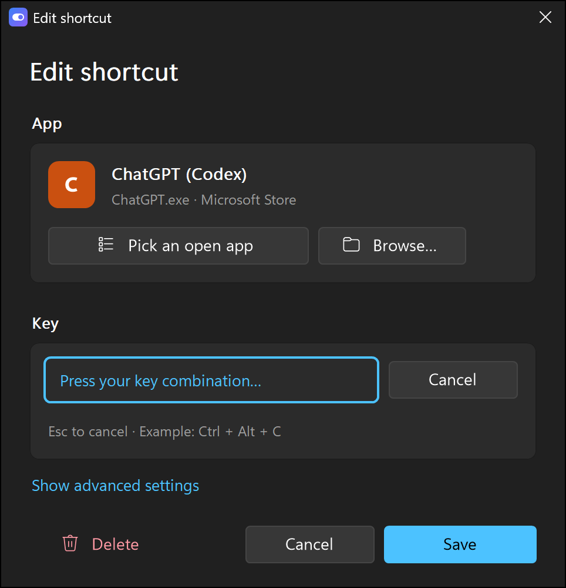

# AppToggle

Open, bring back or minimize any app with a single key, for example the Copilot key on recent keyboards.

**Version française : [README.md](README.md)**

<p align="center">
  
  
</p>

## Features

- **Several shortcuts**, each with its own key and on/off switch.
- **Pick an app without typing anything**: choose from the open windows. AppToggle detects by itself whether it's a Microsoft Store app or a regular program. You can also pick an `.exe` manually.
- **Set the key by pressing it**: just press the combination you want. The Copilot key is supported.
- **Smart toggle**: the app is launched if it's closed, restored if it's minimized, brought to the front if it's hidden behind other windows, and minimized if it's already in front.
- **Visible status**: a colored icon near the clock when AppToggle is on, gray when it's paused.
- **English and French**: follows the Windows language, or pick one in the options.
- **Follows the Windows theme** (dark or light) and accent color.
- **Lightweight**: a single executable of about 1.4 MB, less than 2 MB of active memory in the background, no CPU usage until you press a key.
- **Portable and offline**: settings are saved in `config.ini`, next to the executable. Nothing in the registry, no data collection, no internet connection.

## Installation

1. Download `AppToggle-x.y.z.zip` from the [latest release](https://github.com/RobinsanKiritheepan/AppToggle/releases/latest).
2. Extract it into a folder of your own where it will stay (for example `Documents\AppToggle`), not in Downloads.
3. Double-click `AppToggle.exe`: the settings window opens.

### Windows warning on first launch

The executable isn't signed with a paid certificate, so Windows SmartScreen may show "Windows protected your PC": click **More info**, then **Run anyway**.

The full source code is in this repository, and the SHA-256 hash of each version is published with its release so you can check the file hasn't been modified. Some antivirus tools occasionally flag programs compiled with AutoHotkey by mistake (false positives).

## How to use

1. Open the app you want (Claude, ChatGPT, Discord…).
2. In AppToggle, click **Add**, then **Pick an open app**, and select it.
3. Click **Change** and press the key combination you want, or click **Use the Copilot key**.
4. Click **Save**.

<p align="center">
  
  
</p>

Turn on **Start with Windows** so AppToggle starts with your PC. Clicking the icon near the clock opens the settings again; right-clicking gives you Enabled, Start with Windows and Quit.

So you can still type normally, a combination must include Ctrl, Alt or Win (except special keys such as F13 to F24 or media keys).

## Security and privacy

AppToggle never connects to the internet, collects no data and doesn't need administrator rights. To recognize some keys (including the Copilot key) it uses a Windows keyboard hook, but it never records or sends keystrokes. All the details, good practices and how to report a vulnerability are in [SECURITY.md](SECURITY.md).

## Building from source

Requirement: [AutoHotkey v2](https://www.autohotkey.com) installed.

```powershell
powershell -ExecutionPolicy Bypass -File build.ps1
```

The script downloads the official Ahk2Exe compiler once into `tools\Ahk2Exe` (no administrator rights needed) and checks its hash. It then compiles `src\AppToggle.ahk` into `dist\AppToggle.exe`, and prepares the release files in `dist`: the zip to publish, its SHA-256 hash and the matching AutoHotkey source code. To try it without compiling, just double-click `src\AppToggle.ahk`.

## Project structure

| File | Role |
|---|---|
| `src/AppToggle.ahk` | Entry point: startup, single instance, executable information |
| `src/lib/Engine.ahk` | Links keys to apps; open, bring back or minimize |
| `src/lib/Config.ahk` | Reads and writes `config.ini` |
| `src/lib/Keys.ahk` | Key names and key combination capture |
| `src/lib/Lang.ahk` | French / English translations |
| `src/lib/Tray.ahk` | Icon near the clock, its menu, start with Windows |
| `src/lib/Theme.ahk` | Colors, fonts, dark or light mode |
| `src/lib/Draw.ahk` | GDI+ drawing: cards, switches, buttons, keycaps |
| `src/ui/` | The windows: settings, add or edit a shortcut, pick an app |
| `tools/make-icons.ps1` | Generates the icons in `assets` |
| `build.ps1` | Build and release files |

## `config.ini` format

The file is created on first launch. It's meant to be edited from the settings window, but stays readable (key names are in French):

```ini
[General]
Actif=1
Notification=1
Langue=auto

[Raccourci1]
Nom=Claude
Touche=+#F23
Type=store
Cible=Claude_pzs8sxrjxfjjc!Claude
Processus=claude.exe
Titre=
Actif=1
```

- `Langue` (language): `auto` (Windows language), `fr` or `en`.
- `Touche` (key) uses AutoHotkey syntax: `^` Ctrl, `!` Alt, `+` Shift, `#` Win. The Copilot key is `+#F23`.
- `Type=store`: `Cible` (target) is the Microsoft Store app ID (`Get-StartApps` in PowerShell shows it). `Type=exe`: `Cible` is the full path of the program.
- `Processus` (process) is used to find the app's window; `Titre` (title, optional) filters on part of the window title.

## Licenses and notices

- **AppToggle's code** (scripts, icons, documentation) is released under the MIT license: see [LICENSE](LICENSE).
- **The published executable** contains the [AutoHotkey v2](https://github.com/AutoHotkey/AutoHotkey) interpreter, released under the GNU GPL v2, which includes the PCRE library under a BSD license. `AppToggle.exe` is therefore distributed in compliance with the GPL v2: each release provides AutoHotkey's license (`LICENCE-AutoHotkey.txt`) and the matching AutoHotkey source code.
- Windows and Copilot are trademarks of Microsoft; Claude is a trademark of Anthropic; ChatGPT and Codex are trademarks of OpenAI. AppToggle is an independent project, not affiliated with or endorsed by these companies. Screenshots use demo apps.
