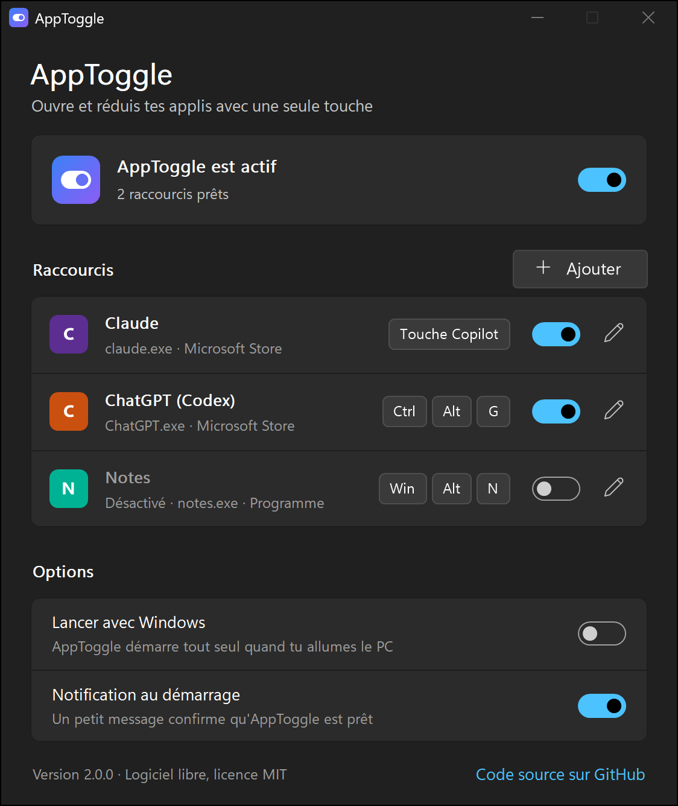
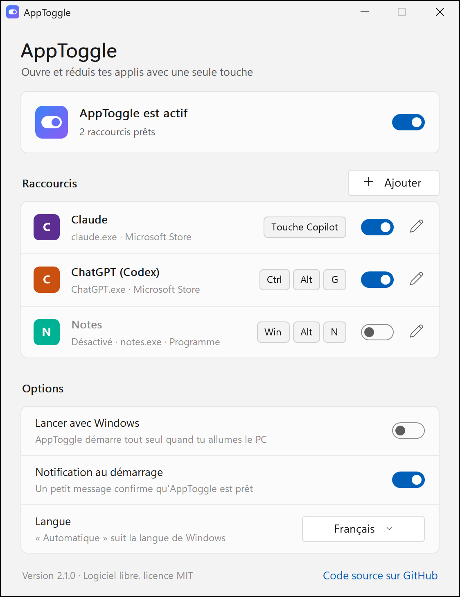
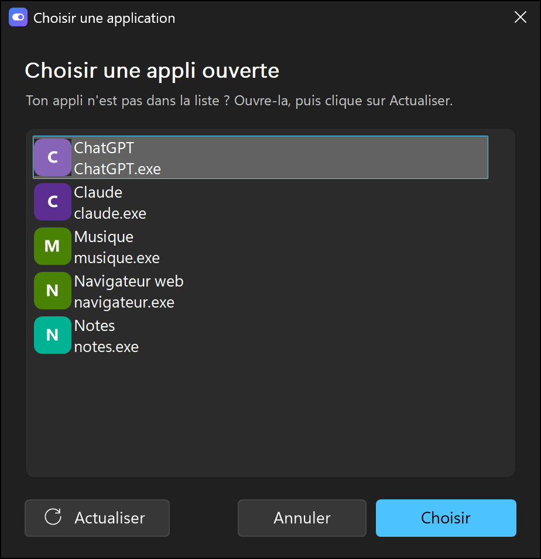
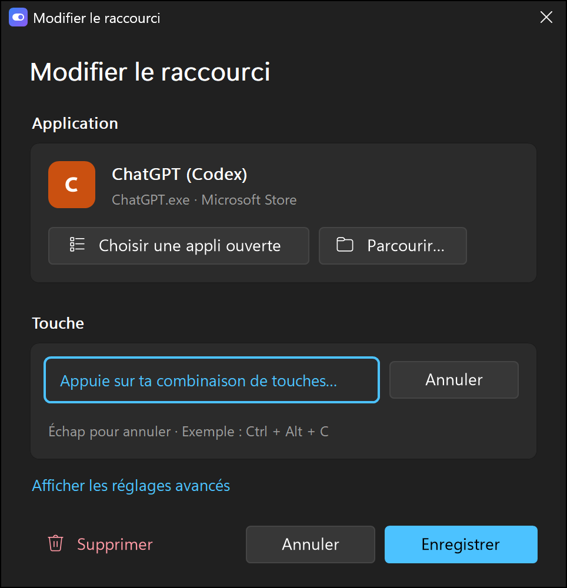

# AppToggle

Ouvre, ramène ou réduit une application avec une seule touche, par exemple la touche Copilot des claviers récents.

**English version: [README.en.md](README.en.md)**

<p align="center">
  
  
</p>

## Fonctionnalités

- **Plusieurs raccourcis**, chacun avec sa touche et son interrupteur marche/arrêt.
- **Choix de l'application sans rien taper** : sélection parmi les fenêtres ouvertes. AppToggle détecte seul s'il s'agit d'une appli du Microsoft Store ou d'un programme classique. On peut aussi choisir un `.exe` à la main.
- **Capture de la touche au clavier** : on appuie sur la combinaison voulue. La touche Copilot est reconnue.
- **Bascule intelligente** : l'appli est lancée si elle est fermée, restaurée si elle est réduite, ramenée au premier plan si elle est cachée derrière d'autres fenêtres, réduite si elle est déjà devant.
- **État visible** : icône colorée près de l'horloge quand AppToggle est actif, grise quand il est en pause.
- **Français et anglais** : la langue suit celle de Windows, ou se choisit dans les options.
- **Suit le thème de Windows** (sombre ou clair) et sa couleur d'accent.
- **Léger** : un dossier d'environ 1,4 Mo, moins de 2 Mo de mémoire active en arrière-plan, aucune activité du processeur tant qu'on n'appuie pas sur une touche.
- **Hors ligne** : la configuration est enregistrée dans `config.ini`, à côté de l'exécutable dans la version zip, dans le dossier `AppData` de Windows dans la version du Store. Rien dans le registre, aucune donnée collectée, aucune connexion Internet.

## Installation

### Microsoft Store (recommandé)

**[AppToggle sur le Microsoft Store](https://apps.microsoft.com/detail/9NN6L7PJ0DFC)** : *en cours de validation par Microsoft, le lien fonctionnera dès la publication.*

C'est la version la plus simple : signée par Microsoft, elle s'installe en un clic, se met à jour toute seule et n'est pas bloquée par le Contrôle intelligent des applications de Windows 11. Pour qu'elle démarre avec le PC, l'option **Lancer avec Windows** d'AppToggle ouvre **Paramètres > Applications > Démarrage**, où il suffit d'activer AppToggle.

### Version portable (zip)

1. Télécharger `AppToggle-x.y.z.zip` depuis la [dernière version publiée](https://github.com/RobinsanKiritheepan/AppToggle/releases/latest).
2. Extraire le zip : il contient un dossier `AppToggle`. Le ranger dans un dossier à toi où il restera (par exemple `Documents`), pas dans Téléchargements.
3. Ouvrir le dossier et double-cliquer sur `AppToggle.exe` : la fenêtre de réglages s'ouvre. Garde tous les fichiers du dossier ensemble.

#### Contrôle intelligent des applications (Windows 11)

Si ce réglage de sécurité est activé sur le PC, Windows bloque la version zip avec le message « Le Contrôle intelligent des applications a bloqué une application potentiellement dangereuse ». Ce n'est pas un virus : Windows bloque tout programme qu'il ne connaît pas et qui n'est pas signé numériquement par un éditeur vérifié, ce qui est le cas de la version zip. **Solution : installer la version du Microsoft Store**, signée par Microsoft. Mieux vaut ne pas désactiver cette protection juste pour AppToggle.

Si Windows affiche seulement « Windows a protégé votre ordinateur » (SmartScreen), cliquer sur **Informations complémentaires**, puis sur **Exécuter quand même**.

#### Pourquoi `AppToggle.exe` est AutoHotkey

Dans la version zip, `AppToggle.exe` est l'interpréteur officiel [AutoHotkey v2](https://www.autohotkey.com), **non modifié**, simplement renommé : il lance tout seul `AppToggle.ahk`, placé à côté de lui. Dans le Gestionnaire des tâches et les propriétés du fichier, AppToggle apparaît donc sous le nom « AutoHotkey ». L'empreinte SHA-256 publiée avec chaque release permet de vérifier que c'est bien l'interpréteur officiel, et tout le reste est du code lisible (`.ahk`).

## Utilisation

1. Ouvrir l'application voulue (Claude, ChatGPT, Discord…).
2. Dans AppToggle, cliquer sur **Ajouter**, puis sur **Choisir une appli ouverte**, et la sélectionner.
3. Cliquer sur **Changer** et appuyer sur la combinaison de touches voulue, ou sur **Utiliser la touche Copilot**.
4. Cliquer sur **Enregistrer**.

<p align="center">
  
  
</p>

Activer **Lancer avec Windows** pour qu'AppToggle démarre avec le PC. Un clic sur l'icône près de l'horloge rouvre les réglages ; le clic droit donne accès à Actif, Lancer avec Windows et Quitter.

Pour ne pas empêcher d'écrire normalement, une combinaison doit contenir Ctrl, Alt ou Win (sauf les touches spéciales comme F13 à F24 ou les touches multimédia).

## Sécurité et vie privée

AppToggle ne se connecte jamais à Internet, ne collecte aucune donnée et n'a pas besoin des droits administrateur. Pour reconnaître certaines touches (dont la touche Copilot), il utilise un crochet clavier de Windows, mais n'enregistre ni n'envoie aucune frappe. Tous les détails, les bonnes pratiques et la façon de signaler une faille sont dans [SECURITY.md](SECURITY.md).

## Construire les versions à partager

### Version zip

```powershell
powershell -ExecutionPolicy Bypass -File build.ps1
```

Le script télécharge une seule fois la version officielle d'AutoHotkey dans `tools\` (sans droits administrateur) et vérifie son empreinte SHA-256. Il assemble ensuite `dist\AppToggle\` (l'interpréteur renommé, les scripts, les icônes et les licences) et contrôle la syntaxe. Enfin, il prépare les fichiers d'une release : le zip, les empreintes SHA-256 et le code source d'AutoHotkey correspondant. Il n'y a rien à compiler. Pour lancer directement depuis le code, avec [AutoHotkey v2](https://www.autohotkey.com) installé, il suffit de double-cliquer sur `src\AppToggle.ahk`.

### Paquet du Microsoft Store

```powershell
powershell -ExecutionPolicy Bypass -File build-store.ps1
```

Le script compile `AppToggle.exe` avec Ahk2Exe (versions et empreintes SHA-256 épinglées, outils de paquet vérifiés par leur signature Microsoft), génère les images du Store et fabrique `dist\store\AppToggle-x.y.z.msix`, avec la licence et le code source d'AutoHotkey. L'identité de l'éditeur vient de `msix\identity.json` (valeurs publiques données par le Partner Center) ; sans ce fichier, il fabrique un paquet de test. C'est Microsoft qui signe le paquet à la publication. Le guide de publication et les textes de la fiche sont dans [docs/STORE.md](docs/STORE.md).

## Structure du projet

| Fichier | Rôle |
|---|---|
| `src/AppToggle.ahk` | Point d'entrée : démarrage, instance unique, informations de l'exécutable |
| `src/lib/Engine.ahk` | Relie les touches aux applis ; ouvrir, ramener ou réduire |
| `src/lib/Config.ahk` | Lecture et écriture de `config.ini` |
| `src/lib/Keys.ahk` | Noms des touches et capture d'une combinaison |
| `src/lib/Lang.ahk` | Traductions français / anglais |
| `src/lib/Tray.ahk` | Icône près de l'horloge, menu, lancement avec Windows |
| `src/lib/Theme.ahk` | Couleurs, polices, mode sombre ou clair |
| `src/lib/Draw.ahk` | Dessin des éléments avec GDI+ : cartes, interrupteurs, boutons, touches |
| `src/ui/` | Les fenêtres : réglages, ajout ou modification, choix d'une appli |
| `tools/make-icons.ps1` | Génère les icônes du dossier `assets` |
| `build.ps1` | Assemblage de la version zip et fichiers de release |
| `build-store.ps1` | Fabrication du paquet Microsoft Store (`.msix`) |
| `msix/` | Manifeste du paquet Store et identité de l'éditeur |
| `docs/STORE.md` | Guide de publication sur le Microsoft Store |

## Format de `config.ini`

Le fichier est créé au premier lancement. Il se modifie depuis la fenêtre de réglages, mais reste lisible :

```ini
[General]
Actif=1
Notification=1
Langue=auto

[Raccourci1]
Nom=Claude
Touche=+#F23
Type=store
Cible=Claude_pzs8sxrjxfjjc!Claude
Processus=claude.exe
Titre=
Actif=1
```

- `Langue` : `auto` (langue de Windows), `fr` ou `en`.
- `Touche` suit la syntaxe AutoHotkey : `^` Ctrl, `!` Alt, `+` Maj, `#` Win. La touche Copilot correspond à `+#F23`.
- `Type=store` : `Cible` est l'identifiant de l'appli du Microsoft Store (`Get-StartApps` dans PowerShell le donne). `Type=exe` : `Cible` est le chemin complet du programme.
- `Processus` sert à retrouver la fenêtre de l'appli ; `Titre` (facultatif) filtre sur un morceau du titre.

## Licences et mentions

- **Le code d'AppToggle** (scripts, icônes, documentation) est distribué sous licence MIT : voir [LICENSE](LICENSE).
- **AutoHotkey** : dans la version zip, `AppToggle.exe` est l'interpréteur [AutoHotkey v2](https://github.com/AutoHotkey/AutoHotkey) officiel, non modifié ; dans la version du Microsoft Store, il est compilé avec Ahk2Exe et contient ce même interpréteur. AutoHotkey est distribué sous licence GNU GPL v2 (il inclut la bibliothèque PCRE, sous licence BSD) : chaque release et le paquet du Store fournissent sa licence (`LICENCE-AutoHotkey.txt`) et son code source pour la version utilisée.
- Windows et Copilot sont des marques de Microsoft ; Claude est une marque d'Anthropic ; ChatGPT et Codex sont des marques d'OpenAI. AppToggle est un projet indépendant, sans lien avec ces sociétés ni approuvé par elles. Les captures d'écran utilisent des applis de démonstration.
